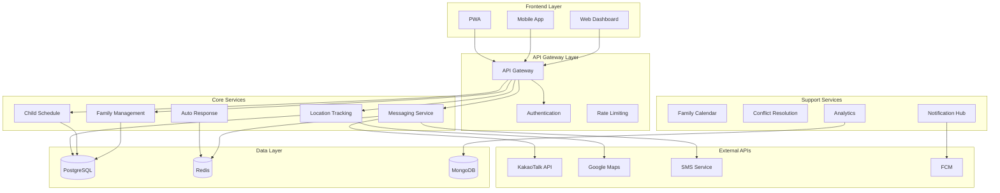

# ACTCS 시스템 아키텍처 상세 설계

## 전체 시스템 개요

ACTCS는 가족 갈등 해소를 위한 자녀 케어 솔루션으로, 마이크로서비스 아키텍처를 기반으로 확장 가능하고 안정적인 시스템을 제공합니다.

## 아키텍처 설계 원칙

### 1. 가족 중심 설계 (Family-Centric Design)
```yaml
설계 철학:
  - 모든 데이터와 기능이 가족 단위로 격리
  - 가족 구성원별 역할 기반 접근 제어
  - 자녀 안전과 프라이버시 최우선 고려

구현 방식:
  - Multi-tenancy: 가족별 데이터 격리
  - RBAC: 역할 기반 세밀한 권한 제어
  - Data Sovereignty: 가족별 데이터 주권 보장
```

### 2. 실시간 투명성 (Real-time Transparency)
```yaml
목표:
  - 정보 비대칭성 해소
  - 실시간 상태 공유
  - 예측적 알림 시스템

구현:
  - WebSocket 기반 실시간 통신
  - Event-driven 아키텍처
  - Push 알림 + 카카오톡 연동
```

### 3. 예방적 갈등 해소 (Proactive Conflict Prevention)
```yaml
전략:
  - 문제 상황 사전 감지
  - 자동화된 해결책 제시
  - 학습 기반 개선

기술:
  - 패턴 인식 알고리즘
  - 예측 분석
  - 자동응답 AI
```

## 마이크로서비스 아키텍처

### 서비스 맵


### 서비스별 상세 설계

#### 1. Family Management Service
```yaml
책임:
  - 가족 구성원 관리
  - 권한 및 역할 관리
  - 가족 설정 관리

API 엔드포인트:
  - GET /families/{familyId}/members
  - POST /families/{familyId}/members
  - PUT /families/{familyId}/members/{memberId}/role
  - GET /families/{familyId}/permissions

데이터베이스:
  - families, family_members, member_permissions
  - children_profiles (자녀 상세 정보)
```

#### 2. Child Schedule Service  
```yaml
책임:
  - 자녀 일정 생성/수정/삭제
  - 알림 스케줄링 관리
  - 출석 상태 추적

API 엔드포인트:
  - GET /children/{childId}/schedules
  - POST /children/{childId}/schedules
  - PUT /schedules/{scheduleId}/status
  - GET /schedules/upcoming

알림 로직:
  - 30분 전: 준비 알림
  - 10분 전: 출발 알림  
  - 지각 위험: 긴급 알림
```

#### 3. Location Tracking Service
```yaml
책임:
  - 실시간 위치 수집 및 저장
  - 안전구역 관리
  - 지오펜싱 알림

API 엔드포인트:
  - POST /location/{childId}/update
  - GET /location/{childId}/current
  - POST /safezones
  - GET /safezones/{familyId}

성능 최적화:
  - 위치 데이터 스트리밍 처리
  - 배터리 효율 최적화
  - 90일 자동 데이터 삭제
```

#### 4. Messaging Service
```yaml
책임:
  - 다채널 메시지 발송
  - 카카오톡 API 연동
  - 메시지 상태 추적

채널 우선순위:
  1. 카카오톡 (Primary)
  2. SMS (Fallback)  
  3. Push 알림 (Supplement)

메시지 유형:
  - 일정 알림
  - 위치 상태
  - 긴급 알림
  - 가족 소통
```

#### 5. Auto Response Service
```yaml
책임:
  - 상황별 자동응답 생성
  - 응답 패턴 학습
  - 개인화된 응답 제공

AI 기능:
  - 자주 사용하는 표현 학습
  - 상황 컨텍스트 이해
  - 가족별 소통 스타일 적응

응답 카테고리:
  - 이동 관련 ("가고 있어요")
  - 건강 관련 ("괜찮아요")  
  - 학습 관련 ("잘 했어요")
```

## 데이터 플로우 아키텍처

### 1. 실시간 위치 추적 플로우
```
[Mobile App] → [Location Service] → [Redis Stream] → [Analytics] → [Family Dashboard]
                      ↓
                [Geofencing Check] → [Messaging Service] → [KakaoTalk/SMS]
```

### 2. 일정 알림 플로우  
```
[Schedule Created] → [Child Schedule Service] → [Redis Queue] → [Messaging Service]
                                                     ↓
[Timer Service] → [30min Alert] → [10min Alert] → [Late Alert]
```

### 3. 자동응답 플로우
```
[KakaoTalk Webhook] → [Auto Response Service] → [AI Processing] → [Response Generation] → [KakaoTalk API]
```

## 보안 아키텍처

### 1. 인증 및 권한
```yaml
인증 방식:
  - JWT Access Token (15분)
  - Refresh Token (7일)
  - 가족별 세션 관리

권한 구조:
  - parent_admin: 모든 권한
  - parent: 자녀 관련 권한
  - child: 제한적 권한
  - observer: 읽기 전용
```

### 2. 데이터 보안
```yaml
암호화:
  - TLS 1.3 (전송 중)
  - AES-256-GCM (저장 중)
  - 위치 데이터 필드별 암호화

접근 제어:
  - 가족별 데이터 격리
  - API Rate Limiting
  - IP 화이트리스트 (옵션)
```

### 3. 프라이버시 보호
```yaml
데이터 최소화:
  - 필요한 데이터만 수집
  - 90일 자동 삭제
  - 사용자 제어 가능

투명성:
  - 데이터 사용 내역 제공
  - 실시간 동의 관리
  - 즉시 삭제 요청 처리
```

## 확장성 및 성능

### 1. 수평 확장 설계
```yaml
Stateless Services:
  - 모든 서비스가 상태를 외부 저장소에 관리
  - 로드밸런서를 통한 자동 분산
  - Auto-scaling 대응

데이터베이스 확장:
  - PostgreSQL Read Replicas
  - Redis Cluster
  - MongoDB Sharding
```

### 2. 성능 최적화
```yaml
캐싱 전략:
  - Redis 기반 다층 캐싱
  - CDN 활용 정적 자원
  - 애플리케이션 레벨 캐싱

비동기 처리:
  - Message Queue 기반 작업 분산
  - 백그라운드 작업 처리
  - 이벤트 기반 아키텍처
```

### 3. 모니터링 및 관측성
```yaml
메트릭 수집:
  - Prometheus + Grafana
  - 실시간 성능 지표
  - 사용자별 대시보드

로깅:
  - 구조화된 로그 (JSON)
  - 중앙화된 로그 수집
  - 검색 및 분석 도구

추적:
  - 분산 트레이싱
  - 요청 플로우 시각화
  - 병목 지점 식별
```

## 배포 및 운영

### 1. 컨테이너 오케스트레이션
```yaml
Kubernetes 구성:
  - Namespace 기반 환경 분리
  - HPA/VPA 자동 스케일링
  - Rolling Update 무중단 배포

서비스 메시:
  - Istio Service Mesh
  - 트래픽 관리
  - 보안 정책 적용
```

### 2. CI/CD 파이프라인
```yaml
개발 워크플로우:
  - Git Flow 기반 브랜치 전략
  - 자동화된 테스트 실행
  - 코드 품질 검증

배포 전략:
  - Blue-Green 배포
  - Canary 배포
  - Feature Flag 기반 점진적 출시
```

이 아키텍처를 통해 ACTCS는 가족 갈등 해소라는 목표를 달성하면서도 확장 가능하고 안정적인 서비스를 제공할 수 있습니다.